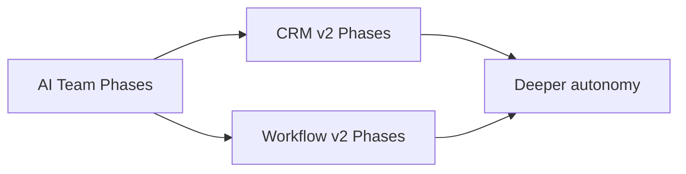

# Aarvanta AI OS — Implementation Roadmap

Ordered delivery across AI Team, CRM v2, and Workflow Studio v2. Each ticket should cite a section in these packs.

**Status:** Phase 0 (program roadmap).

---

## 1. Sequencing principle

Ship **UX shell → orchestration → context → autonomy** per module. Do not big-bang rewrite schemas. Reuse Ask AI and plan-before-act everywhere.

---

## 2. AI Team (reference — largely in flight)

See [`docs/ai-team-v2/`](../ai-team-v2/).

| Phase | Focus |
|-------|-------|
| 0–1 | PRDs + Chat/Jobs/Waiting/Activity/Settings shell |
| 2 | Plan-before-act command |
| 3 | Ask AI everywhere |
| 4 | Knowledge/Finance context; send approvals |

---

## 3. CRM v2

See [`docs/crm-v2/05-ai-behavior-roadmap.md`](../crm-v2/05-ai-behavior-roadmap.md).

| Phase | Focus | Depends on |
|-------|-------|------------|
| 1 | UI redesign (People/Sales IA, Ask AI, narrative dashboard) | Ask AI component |
| 2 | Relationship Timeline | CRM activities + inbox links |
| 3 | Smart capture + stage suggestions | Timeline + scoring |
| 4 | Predictive briefing | Heuristic dashboard |
| 5 | Autonomous CRM (policy-gated) | Approvals + Automations |

---

## 4. Workflow Studio v2

See [`docs/workflow-studio-v2/05-ai-behavior-roadmap.md`](../workflow-studio-v2/05-ai-behavior-roadmap.md).

| Phase | Focus | Depends on |
|-------|-------|------------|
| 1 | Automations dashboard + quick cards | Existing generate/run |
| 2 | NL plan-before-save + conversational edit | AI Team plan UX patterns |
| 3 | Visual explain flow | Stable step model |
| 4 | Durable delays / retries | Scheduler/worker design |
| 5 | Analytics | Run history |

---

## 5. Cross-cutting program milestones

| Milestone | Exit criteria |
|-----------|----------------|
| M1 Docs | This AI OS pack + CRM + Workflow PRDs landed |
| M2 CRM shell | People/Sales nav live; old URLs resolve |
| M3 Automations shell | Home rebranded; generate+approve still green |
| M4 Shared approvals | Waiting language consistent for job + workflow send |
| M5 Timeline | Person timeline composes CRM + inbox |
| M6 Capture | NL capture commit in demo |
| M7 Durable automation | Real wait + resume |

---

## 6. Working agreement for Cursor

1. One phase per PR when possible  
2. Cite pack section in PR body  
3. No commits of secrets; demo mode for local verify  
4. Prefer aliases/redirects over breaking deep links  
5. Implementation only after explicit Phase ticket approval  

---

## 7. Out of scope for early milestones

- 180–500 page monolith PRDs  
- Full Zapier connector ecosystem  
- Silent autonomous customer messaging  
