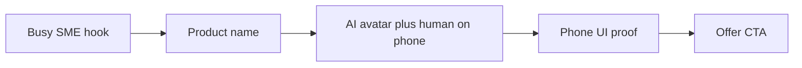

# AI-story ad format — analysis & Aarvanta adaptation

## What the reference ad is

A ~59s **vertical generative-AI mini-movie** (Coursiv-style “AI ads course” creative), not raw UGC.

| Layer | Reference pattern |
| --- | --- |
| Story | SME vignette (busy business) → “fully booked” / overloaded hook |
| Dialogue | Short character exchange → product name drop |
| Mechanism | Split-screen: stylized AI figure + waveform (top) / person on phone (bottom) |
| Proof loop | Phone UI walked through as “proof the product works” |
| CTA | Hard offer punch |
| Always-on | Kinetic captions (white + yellow keyword highlights) + AI disclaimer |

## What we copy vs what we discard

| Copy (format system) | Discard (their plot / offer) |
| --- | --- |
| 9:16 mute-first storytelling | Nail salon / course lesson plot |
| Split-screen AI + human on phone | Generic ads-bot character as the hero brand |
| Kinetic captions with accent keywords | Yellow-only highlight if it fights Aarvanta gold |
| Real-feeling phone UI as proof | Fake curriculum / course UI |
| Persistent generative-AI disclaimer | “$20 TRY ME” course pricing |
| 55–65s single-thread narrative | Essay-length VO read on screen |

## Mapping founder essays → this format

Your pillar scripts are **dense thought leadership**. The ad format needs **short caption beats**.

| Essay density | Ad treatment |
| --- | --- |
| Full paragraph of pain | One visual montage + 1–2 caption lines |
| List of tools / failures | Rapid icon or logo stack; 1 word or short phrase each |
| Philosophical closer | One golden line on black/navy, then CTA |
| Full argument | Lives in **post caption**, not burned into every frame |

**Rule:** If a line can’t be read in under ~2 seconds on mute, split it or move it to the post.

## Aarvanta Ad #1 adaptation (Stop Adding More Tools)

| Reference beat | Aarvanta beat |
| --- | --- |
| Busy salon / fully booked | Tool-logo / tab chaos — twenty apps, less clarity |
| “How do you manage?” | “Tools don’t automatically create **systems**.” |
| Product name | **AARVANTA** — connected operations, not another tool |
| AI split-screen | Aarvanta specialist + founder calmly using phone |
| Course UI on phone | Real OS: communication hub, CRM, AI Team Chat → Jobs → Waiting |
| Price CTA | **Start free** / **See AI Team** |

## Caption system (series standard)

- Position: lower-third safe zone (keep above home indicator; clear of logo end card)
- Style: bold sans; white fill; soft navy shadow for legibility on bright UI
- Highlight: gold `#a8894f` / `#b3965d` on systems words (`systems`, `clarity`, `connected`, `simpler`)
- Pace: punch phrases synchronized to cuts; avoid walls of text

## Compliance (always)

Small persistent or end-of-spot disclaimer:

> Dramatized scenes may use generative AI. Results vary. Aarvanta does not guarantee specific business outcomes.

## Related docs

- [series-overview.md](./series-overview.md)
- [ad-01-stop-adding-tools.md](./ad-01-stop-adding-tools.md)
- [production-brief.md](./production-brief.md)
