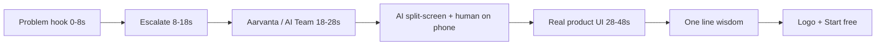

# Aarvanta AI-story ad series — overview

Vertical (9:16) founder thought-leadership ads. Same production system every episode; one narrative pillar per episode.

## Series goal

Position Aarvanta OS as **connected operations** (not another app in the pile). Each ad ends with a product proof moment and a clear CTA: **Start free** or **See AI Team**.

## Episode map

| Ad | Working title | Source pillar | Emotion | Product proof (phone UI) | Status |
| --- | --- | --- | --- | --- | --- |
| **#1** | Stop Adding More Tools | Tool sprawl → systems | Clarity vs confusion | Hub: WhatsApp OS / CRM / AI Team Chat → Jobs | **Pack ready** |
| #2 | You Are Not Busy — Stuck In Operations | Operator → builder | Freedom vs exhaustion | AI Team Jobs, Waiting for You, automations | Outline only |
| #3 | The Most Expensive Word Is Later | Cost of delay | Urgency without fear-mongering | CRM follow-ups, tasks, missed-lead prevention | Outline only |
| #4 | Your Team Shouldn't Need To Ask | Founder bottleneck → clarity | Relief / ownership | Knowledge, roles, visible priorities | Outline only |
| #5 | Progress, Not Activity | Busy ≠ growth | Outcomes focus | Pipeline wins, retention, delivery signals | Outline only |

## Shared format (every ad)

| Layer | Rule |
| --- | --- |
| Length | 55–65s |
| Aspect | 9:16, 1080×1920 |
| Sound | VO optional; captions carry the story (mute-first) |
| Captions | White body + **gold highlight** on key words (`#a8894f` / `#b3965d`) |
| Brand | Navy `#1a2f59`, gold `#a8894f`, light surfaces — match logo hierarchy |
| AI character | Stylized Aarvanta specialist (not generic ads-bot); soft waveform in navy/gold |
| Phone UI | Real product screen recordings — never fake course lessons |
| Disclaimer | Persistent small line: generative AI used for dramatized scenes; results vary |
| CTA | Start free / See AI Team (no invented $20 course price) |

## Caption vs post

- **On-screen:** compressed kinetic lines (plan Ad docs).
- **Post caption (LinkedIn / IG / X):** full pillar essay under the video.

## Ad #2–#5 — angle stubs (full packs later)

### Ad #2 — Stuck in operations
- Open: twelve-hour day, business didn’t move.
- Shift: operator → builder (direction, partnerships, strategy).
- Proof: AI Team handles follow-ups / jobs while founder focuses on growth work.
- Close: systems give freedom; dependency takes it away.

### Ad #3 — “Later”
- Open: stack of “we’ll do it later.”
- Cost montage: forgotten customer, delayed payment, lost deal.
- Proof: CRM + tasks catch what “later” drops.
- Close: organisation is a reason you succeed — not a reward after.

### Ad #4 — No more ops questions
- Open: office day where nobody asks the founder ops questions.
- Contrast: every answer/approval waiting on the founder = founder is the bottleneck.
- Proof: clarity in OS — assigned work, visible priorities, knowledge.
- Close: leadership = environment where people find answers.

### Ad #5 — Progress not activity
- Open: 200 emails / 15 meetings / 80 tasks — so what?
- Ask: did the business move forward?
- Proof: outcomes visible in CRM / delivery / retention signals.
- Close: ask “What improved today?”

## Reuse checklist

- [ ] Same caption style pack (font, highlight color, safe margins)
- [ ] Same end card (logo + CTA treatment)
- [ ] Same disclaimer burn-in
- [ ] Same UI capture staging account / demo tenant for continuity
- [ ] Series numbering in post text (`Aarvanta Systems · 1/5`) optional, not burned into video unless brand asks

## File index

| File | Purpose |
| --- | --- |
| [ai-story-ad-analysis.md](./ai-story-ad-analysis.md) | Reference format → Aarvanta adaptation |
| [ad-01-stop-adding-tools.md](./ad-01-stop-adding-tools.md) | Ad #1 timed script + captions + essay |
| [ad-01-shot-list.md](./ad-01-shot-list.md) | Ad #1 storyboard |
| [production-brief.md](./production-brief.md) | Tools, brand, export, legal |
| [static-posts/](./static-posts/) | Square feed image samples + captions + keyword kit |
